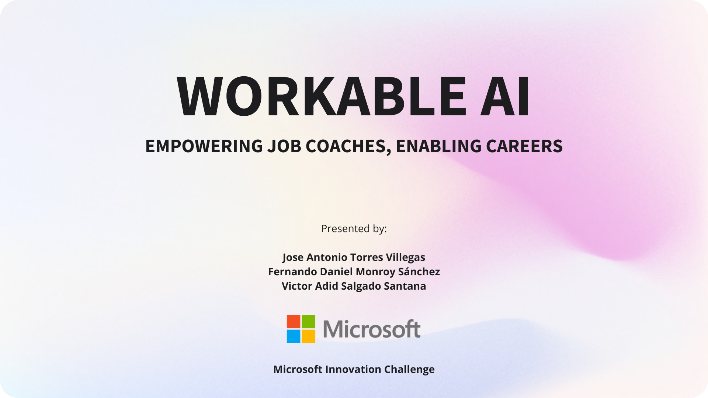
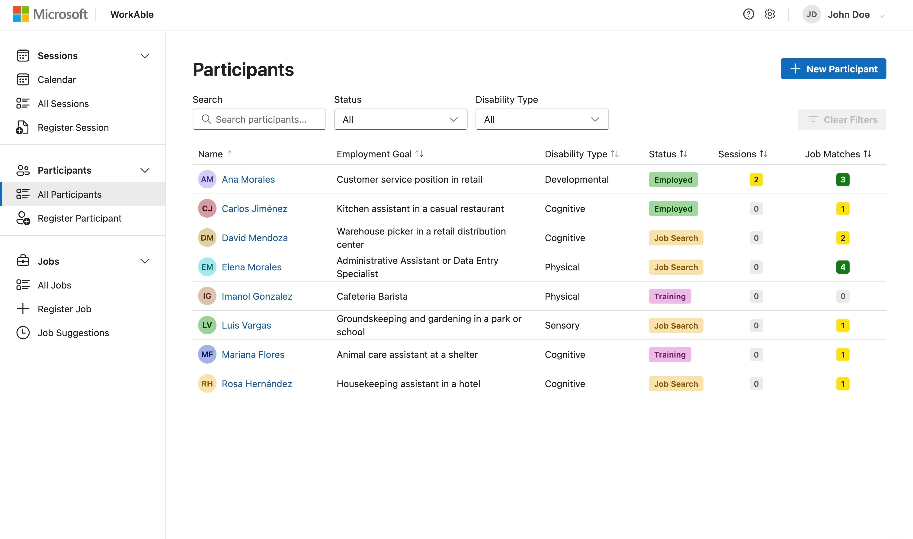
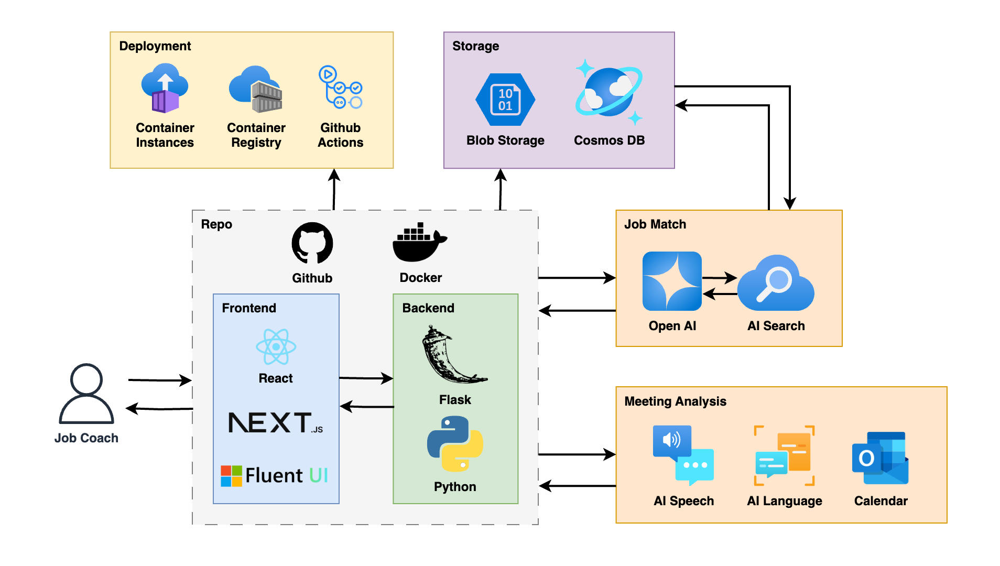

# WorkAble AI: Empowering Job Coaches, Enabling Careers



## Overview

WorkAble AI is an intelligent platform designed to support employment coaches who work with people with disabilities. By leveraging Azure AI services, the system enhances coach productivity, streamlines administrative tasks, and improves job matching outcomes. Our solution addresses the critical challenge faced by supported employment programs: limited resources for job coaches who must simultaneously manage documentation, deliver personalized training, solve emerging problems, and provide motivational support to participants.

Through intelligent automation and AI-powered insights, WorkAble AI allows coaches to focus more on meaningful interactions with participants and less on administrative burdens, ultimately improving employment outcomes for people with disabilities.



## Key Features

- **Participant Management**: Complete profiles with skills, preferences, and employment history
- **Smart Session Management**: Schedule, record, and analyze coaching sessions
- **Intelligent Job Matching**: AI-powered recommendations based on participants' abilities and preferences
- **Coaching Insights**: AI-generated observations and action suggestions for personalized support
- **Interactive Dashboard**: Filter and sort participants by employment stage and view key statistics
- **Calendar Integration**: Coordinate and track sessions with participants

### Solution to problematics

| **Problematics**                          | **Solutions**                                                      |
| ----------------------------------------- | ------------------------------------------------------------------ |
| Struggling to manage administrative tasks | Calendar, Group of tables and forms (Sessions, Participants, Jobs) |
| Personalized support                      | Job Suggestions / AI Insights                                      |
| Real-time problem-solving                 | Job Suggestions / AI Insights                                      |

## Architecture / Tech Stack

WorkAble AI leverages multiple Azure services to deliver a comprehensive solution:



### Repo

Serves as the central code repository, housing both the frontend and backend code. Ensures version control and collaborative development workflows.

- **GitHub**: Stores and manages the codebase, issues, and pull requests.
- **Next.js / React**: Frontend framework and library for building interactive user interfaces.
- **Fluent UI**: Provides a consistent design language and UI components.
- **Flask / Python**: Backend framework and language for handling server-side logic and API routes.
- **Docker**: Containerizes the application for consistent and portable deployments.

### Deployment

Automates building, testing, and deploying both the frontend and backend. Ensures the latest code changes are continuously integrated and delivered.

- **GitHub Actions**: Automates CI/CD pipelines (build, test, and deploy).
- **Azure Container Registry**: Stores Docker images for the frontend and backend.
- **Azure Container Instances**: Hosts and runs the containerized applications in a managed environment.

### Storage

Manages structured and unstructured data, including documents, media, and user information. Ensures secure, scalable data access for the platform.

- **Azure Blob Storage**: Stores unstructured data such as session recordings and uploaded files.
- **Azure Cosmos DB**: Stores participant profiles, job listings, and other structured data in a NoSQL format.

### Job Match

Analyzes participant profiles and job listings to provide intelligent job recommendations. Leverages AI-driven search and language models to match skills and preferences accurately.

- **Azure AI Search**: Retrieves and ranks relevant job postings based on participant data.
- **OpenAI / GPT-based Models**: Enhances job-matching logic with advanced language understanding.

### Meeting Analysis

Transcribes and processes meeting conversations for insights and action items. Assists job coaches by generating real-time suggestions and storing key discussion points.

- **AI Speech**: Converts spoken content into text for further analysis.
- **AI Language**: Extracts entities, sentiments, and insights from transcribed text.
- **Calendar Integration**: Synchronizes meeting schedules and notifications with Microsoft Outlook.

## Responsable AI

Microsoft has established seven core principles to ensure the responsible development and deployment of AI technologies. Below is a table outlining these principles and their presence in the development of the project.

| **Principles**         | **How they are included**                                                                                                                                                                                                                                                                                                                                                                                                                                                                                                                                                                                                                                                                                                               |
| ---------------------- | --------------------------------------------------------------------------------------------------------------------------------------------------------------------------------------------------------------------------------------------------------------------------------------------------------------------------------------------------------------------------------------------------------------------------------------------------------------------------------------------------------------------------------------------------------------------------------------------------------------------------------------------------------------------------------------------------------------------------------------- |
| Fairness               | - Using objective, skills-based matching criteria without relying on Personal Identifiable Information (PII) in job suggestions<br>- Consistently applying the same job matching criteria to all participants with similar qualifications and needs<br>- Evaluating compatibility based on relevant factors like skills, accommodations needed, transportation status, and employment goals—not personal characteristics<br>- Maintaining balance between participant needs and job requirements without favoring certain groups                                                                                                                                                                                                        |
| Inclusiveness          | - Designed to support people with disabilities in finding and retaining meaningful employment<br>- Promotes social inclusion by helping job coaches focus on empowering participants through AI-assisted insights<br>- Considers accessibility features, supportive environments, and accommodation availability in job matches                                                                                                                                                                                                                                                                                                                                                                                                         |
| Reliability and Safety | - Analyzing multiple dimensions of compatibility (skills, accommodations, location, schedule, etc.) for robust matching<br>- Presenting job compatibility reasons that coaches can verify and validate<br>- Leaving final match decisions to human coaches who understand nuanced participant needs<br>- Maintaining structured data schemas that ensure consistent evaluation criteria<br>- Supporting coaches with clear visualizations and organized information to prevent oversight of critical factors<br>- Providing tools for ongoing session tracking and participant progress monitoring to ensure continuous support                                                                                                         |
| Transparency           | - Clearly displaying compatibility reasons for each job match, helping coaches understand why specific recommendations were made<br>- Showing match scores based on objective criteria from participant and job profiles<br>- Providing detailed job information and participant requirements side-by-side for transparent comparison<br>- Enabling coaches to see which specific factors (like required skills, accessibility features, accommodations) contributed to match recommendations<br>- Offering visibility into the matching process through detailed views that expose the reasoning behind AI suggestions<br>- Supporting coach decision-making with clear information presentation rather than black-box recommendations |
| Privacy and Security   | - Not using Personal Identification Information in the job matching algorithms<br>- Implementing strict access controls where only authorized coaches can access their participants' personal information<br>- Using secure database partitioning with appropriate keys (as shown in the Cosmos DB container configuration)<br>- Storing sensitive data in compliance with data protection regulations<br>- Separating personal identifiers from matching criteria to maintain privacy during job suggestions<br>- Ensuring that participant data is well-protected and safely stored in secure cloud infrastructure<br>- Maintaining appropriate data boundaries between different user roles in the system                            |
| Accountability         | - Humans remain in control<br>- Provides intelligent job suggestions, but the final decisions are always made by the job coach<br>- Ensures human oversight and ethical decision-making throughout the process                                                                                                                                                                                                                                                                                                                                                                                                                                                                                                                          |

## Getting Started

### Prerequisites

- Azure account with necessary services provisioned
  - See [Manual Azure Setup Guide](./infra/manual-setup.md) for required resources
- Choose one of the following setups:
  - **Docker setup**: Docker and Docker Compose installed
  - **Local setup**: Node.js (v16 or later) and Python 3.9+

### Installation

#### Option 1: Docker Setup (Recommended)

1. Clone the repository:

```bash
git clone https://github.com/ferDMS/ms-challenge.git
cd ms-challenge
```

2. Create environment files:

```bash
# Create .env files from examples for both services
cp app/frontend/.env.example app/frontend/.env
cp app/backend/.env.example app/backend/.env
```

3. Update the environment variables with your Azure service credentials.

4. Start the application using Docker Compose:

```bash
# For development (with hot-reloading)
docker-compose -f docker-compose.dev.yml up

# For production build
docker-compose up
```

The application will be available at http://localhost:3000 and the API at http://localhost:5001.

#### Option 2: Local Setup

1. Clone the repository:

```bash
git clone https://github.com/ferDMS/ms-challenge.git
cd ms-challenge
```

2. Install dependencies for both frontend and backend:

```bash
# Frontend
cd app/frontend
npm install

# Backend
cd ../backend
pip install -r requirements.txt
```

3. Set up environment variables:

```bash
# Create .env files from examples
cp app/frontend/.env.example app/frontend/.env
cp app/backend/.env.example app/backend/.env
```

4. Update the environment variables with your Azure service credentials.

5. Start the development servers:

```bash
# Frontend
cd app/frontend
npm run dev

# Backend (in a separate terminal)
cd app/backend
flask run --port=5001
```

The application will be available at http://localhost:3000.

### Azure Resource Setup

This application requires several Azure services to function properly. For detailed setup instructions, see:

- [Manual Azure Setup Guide](./infra/manual-setup.md) - Step-by-step instructions for creating required resources
- [Infrastructure Templates](./infra/README.md) - ARM templates for automated deployment

## Development

### Project Structure

```
/app
  /frontend        # Next.js React application
  /backend         # API services and Azure integrations
/docs              # Documentation and guides
/infra             # Infrastructure deployment templates
/docker            # Docker setup files
```

### Key Components

- **Participant Dashboard**: View and manage participant information
- **Session Management**: Record and analyze coaching sessions
- **Job Listing**: Browse and assign job opportunities
- **Calendar View**: Manage upcoming sessions and availability

## Future Enhancements

- **Voice Transcription**: Automatic transcription and analysis of coaching sessions
- **Mobile Application**: Enable on-the-go access for job coaches working in the field
- **Advanced Analytics**: Deeper insights into coaching effectiveness and outcomes
- **Expanded Job Sources**: Integration with additional job boards and employment databases
- **Family Portal**: Secure access for families to view progress and contribute information

## Technology Stack

- **Frontend**: Next.js, TypeScript, Fluent UI React components
- **Backend**: Node.js, Express
- **AI/ML**: Azure OpenAI, Azure AI Document Intelligence
- **Data Storage**: Azure Cosmos DB, Azure Blob Storage
- **Search**: Azure AI Search

## Resources

- [Environment Setup Guide](./docs/environment-setup.md)
- [Azure OpenAI Service](https://learn.microsoft.com/azure/cognitive-services/openai/overview)
- [Azure AI Search](https://learn.microsoft.com/azure/search/search-what-is-azure-search)
- [Microsoft Supported Employment](./docs/supported_employment/)

## License

This project is licensed under the MIT License - see the LICENSE file for details.
